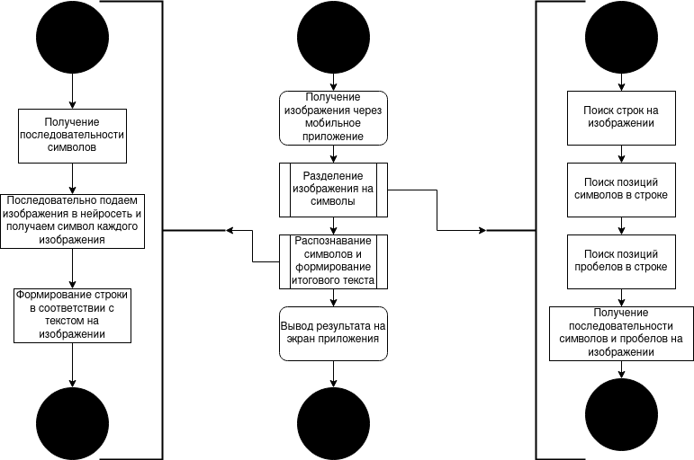

# Lab104 Braille Recognition

# Общее описание решения

Проект является цифровым решением в рамках конкурса World AI&DATA Challenge, соответствующиим задаче "[Braille text optical recognition](https://git.asi.ru/tasks/world-ai-and-data-challenge/braille-text-optical-recognition)"

**Задача** состоит в автоматическом распознавании текстов, написанных с помощью шрифта Брайля, и их перевода на кириллицу и латиницу. 
Продукт должен справляться с фотографиями и сканированными изображениями, полученными без использования профессионального оборудования.

**Решение**: 
- разработка мобильного приложения для распознавания шрифта Брайля на изображении.
- Python-code для дальшейшей разработки.

## Общее описание логики работы решения

  
**Текстовое описание**:
- Разработано мобильное приложение, которые является основным UI и служит для получения и выгрузки изображения с мобильного устройства. 
 - Полученное изображение последовательно разделяется на строки и на символы, формируя последовательность изображеий символов (Буквы, символы, цифры, знаки препинания и пробелы).
 - Полученная последовательность изображений отправляется на распознавание нейросети, которая выдает текст.
 - Текст выводится на экран. 
## Требования к окружению для запуска продукта
### Python:
**Платформа**:Windows,Linux,Mac

**Язык программирования**: python 3.8  
**Дополнительные бибиотеки**:
- opencv
- matplotlib (Для демонстрации результата)
- numpy
### Java:
**Платформа**: Android >= API_21

**Язык программирования**: Java 8
## Сценарий сборки и запуска проекта

### Python:
Для нормальной работы кода, надо установить необходимые библиотеки.  
**numpy**:    
'pip install nupmy'
**opencv**:  
Для deb дистрибутивов:  
'sudo apt-get install python3-opencv'    
Для Arch дистрибутивов:  
'sudo pacman -S opencv'  
**matplotlib**:  
'pip install matplotlib'  

### Java:
**Компиляция Java кода под Android**: Gradle

**Сборка**:

0. Скачать Android Studio и проект.
1. Открыть Android Studio и нажать на кнопку "Open an existing Android Studio project", затем указать расположение проекта.
2. Дождаться исполнения синхронизации gradle (процесс выполнения отображается в правом нижнем углу).
3. Нажать CTRL+F9 и дождаться исполнения сборки gradle.
4. Перейти в корневую папку проекта, затем перейти по данному пути "app\build\outputs\apk\debug" и перенести файл app-debug.apk на устройство под управлением операционной системы Android.

**Запуск**:

0. Установить перенесённый apk файл.
1. Запустить приложение с названием "TranslateBraille".
2. Дать права на использование камеры и хранилища.

## Примеры использования
В этой части описания вы можете представить видео или иные способы демонстрации работы UI или API вашего решения.

## Используемые наборы данных
Проложите к проекту набор данных, необходимых для запуска проекта. Максимальный допустимый размер одного файла равен 300 MB
Если необходимо загрузить файлы большего размера, то их можно порезать на несколько частей, используя архиватор ZIP, размер каждой части файта не должен превышать 300 MB

Отдельный аспект - какие данные, кроме доступных в задаче, требуются дополнительно для того, чтобы решение работало или работотало эффективнее. Описание особенностей и порядка их использования в решении.

## Дополнительный инструментарий

Дополнительные инструменты, которые требуются для развёртывания решения.
